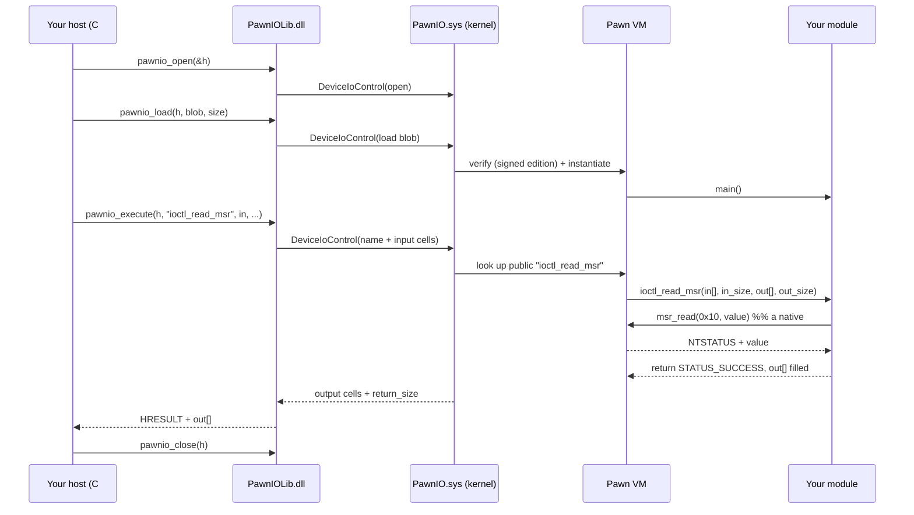

# 1. Architecture

## The problem PawnIO solves

To read a CPU temperature, a fan controller must execute privileged
instructions — `rdmsr`, `in`/`out`, PCI config reads. User mode can't do that,
so historically each tool shipped its **own** kernel driver (WinRing0, inpout32,
…). Those drivers exposed *raw* primitives ("read any MSR", "write any port") to
**any** process, so malware abused them to disable anti-cheat/AV, patch kernel
memory, etc. This is the infamous **BYOVD** (Bring Your Own Vulnerable Driver)
class of attacks, and it's why Microsoft now blocklists many of those drivers.

PawnIO's answer: ship **one** signed, audited driver that does not expose raw
primitives directly. Instead it runs a **sandboxed bytecode program** (your
module) that you wrote against a curated set of natives, and only exposes the
specific, named `ioctl_*` operations that module chose to publish. A module can
still be powerful, but it is *fixed at load time*, *inspectable*, and (in the
signed edition) *author-signed*.

## The moving parts

| Component | Where it runs | What it is |
|---|---|---|
| **PawnIO.sys** | kernel | The signed driver. Embeds a 64-bit Pawn VM (AMX interpreter) and implements the native functions. |
| **A module** (`.amx`) | inside the VM | Your compiled Pawn program. Declares `main`, optional `unload`, and `ioctl_*` handlers. |
| **PawnIOLib.dll** | user mode | Thin wrapper over the `DeviceIoControl` protocol: `pawnio_open/load/execute/close`. |
| **Your host** | user mode | Any program (C#, Python, C++, …) that links PawnIOLib and calls modules by name. |
| **pawncc** | build machine | The Pawn compiler; turns `.p` source into `.amx` bytecode. Runs on any OS. |

## What is "Pawn" / "AMX"?

[Pawn](https://www.compuphase.com/pawn/pawn.htm) is a small, C-like scripting
language by CompuPhase. Source (`.p`) compiles to **AMX** ("Abstract Machine
eXecutable") bytecode (`.amx`), executed by a tiny interpreter — the *Abstract
Machine*. PawnIO embeds that interpreter **in the kernel** and compiles modules
with **64-bit cells** (`-C64`), so one Pawn "cell" is a full 64-bit value —
convenient for addresses, MSRs, and registers.

Because it's an interpreter, a buggy module can't execute arbitrary native code:
it can only do what the natives allow, with bounds-checked arrays and a managed
stack/heap. (The natives themselves are still powerful — see the safety model
below.)

## End-to-end request flow



## The IOCTL / execute protocol

`pawnio_execute` marshals a small wire payload:

```
[ 32-byte function name (null-terminated) ][ input cells (ULONG64 each) ]
```

The driver reads the name, finds the matching **public** function in your module
(they're exported by name — that's why a module's entry points must be `public`,
which the `DEFINE_IOCTL*` macros handle), runs it, and copies the output cells
back along with a `return_size` in bytes. Everything is 64-bit cells on both
sides, which is why the host uses `ULONG64[]` / `ulong[]` / `c_uint64`.

Convention: callable entry points are named `ioctl_*`. See
[writing modules](03-writing-modules.md) and the
[user-space API](04-userspace-api.md).

## The security model (why this is safer than WinRing0)

1. **Bytecode sandbox.** Modules run in an interpreter with bounds-checked
   memory; they can't jump to arbitrary code or scribble outside their arrays.
2. **Curated natives.** A module can only call the functions in
   [`native.inc`](../modules/include/native.inc). Powerful, yes — but a fixed,
   auditable surface.
3. **Named, fixed operations.** User space can only invoke the `ioctl_*` a
   module chose to export, with sized buffers. A well-written module
   *whitelists* exactly the registers/addresses it needs (see `modules/msr.p`),
   so it can't be turned into a general-purpose "read any MSR" weapon.
4. **Signed edition.** By default the driver loads **only modules signed by the
   PawnIO author**, so an attacker can't drop in a malicious module. Running your
   own modules requires the **unrestricted** edition + test signing — a
   deliberate speed bump. See [signing & editions](05-signing-and-editions.md).

None of this makes the *natives* safe to misuse: `physical_write_*`, `io_out_*`,
`msr_write`, and `cr_write` can still brick or crash a machine. The sandbox
protects the *kernel's integrity from the interpreter*, not your hardware from a
bad module. Write modules carefully.
